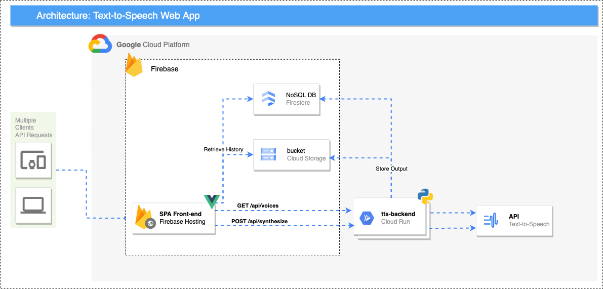

# Google Cloud Text-To-Speach Utility
This repository contains the source code for a GCP Text-To-Speach (TTS) Web App hosted on GCP + Firebase.

## Services
- Firebase Hosting (Cloud CDN + Cloud Storage)
- Firestore
- Cloud Storage
- Cloud Run
- Text-To-Speech

## Required permissions to deploy
- `roles/editor`
  
## Architecture 
  
  
    
## How to deploy
```bash
git clone git@gitlab.com:google-cloud-ce/demos/hertz-text-to-speech-web-app.git

cd hertz-text-to-speech-web-app

# Log in to gcloud cli 
gcloud auth login

# Prepare the GCP project
make tf-backend

# Deploy the web App
make all

```