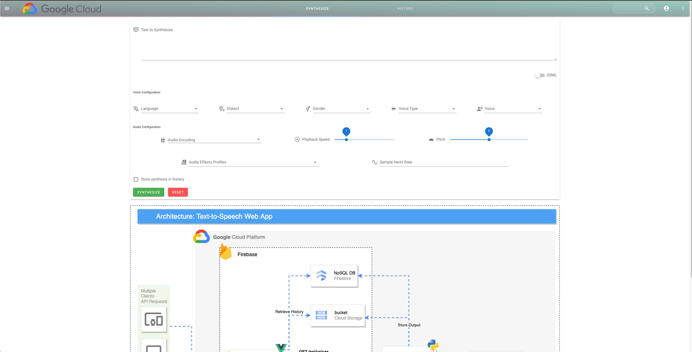

# Google Cloud Text-To-Speach Utility
This repository contains the source code for a GCP Text-To-Speach (TTS) Web App hosted on GCP + Firebase. Deployment instructions can be found below.

## Services
- Firebase Hosting (Global CDN + Cloud Storage)
- Firestore
- Firebase Auth
- Cloud Storage
- Cloud Run
- Text-To-Speech

## Required permissions to deploy
- `roles/editor`
  
## Dependencies

- `terraform >= 1.0.0`
- `gcloud cli >= 385.0.0`
- `gsutil cli >= 5.10`
- `firebase cli >= 10.4.2`
- `nodejs >= v18.1.0`
- `npm >= 8.8.0`
- `curl >= 7.79.1`

## Architecture 
  
  

## Required GCP APIs
All GCP APIs required for this solution are documented in [./config/apis.txt](./config/apis.txt). By default, `make tf-backend` will enable each of these APIs
  

## Organization Policies
This solution deploys service accounts as well as a public Cloud Run service, which often tend to be blocked by some organizations via Org Policies. The Org Policy constraints which could prevent this solution from being deployed are documented in [./config/disable_boolean_constraint_policies.txt](./config/disable_boolean_constraint_policies.txt) and [./config/disable_list_constraint_policies.txt](./config/disable_list_constraint_policies.txt). If your deployment is being blocked, uncomment line #99 in [./scripts/create_tf_backend.sh](./scripts/create_tf_backend.sh) and rerun `make tf-backend`. Please note that you must have permissions to remove Orgnization Policies from your project in order for this to work.
   
## How to deploy
```bash
# Clone repo 

cd gcp-text-to-speech-demo

# Review the default configuration in variables.tfvars and modify as needed

# Log in to gcloud cli 
gcloud auth login

# Configure your CLI to point to the GCP project you want to deploy into
gcloud config set project ${YOUR_GCP_PROJECT_ID}

# Prepare the GCP project
make tf-backend

# Deploy the web App
make app

# Optional cleanup of any remaining artifacts
make clean

```
  
## Front End Screenshots
### Synthesize Tab  
  
  
### History Tab
