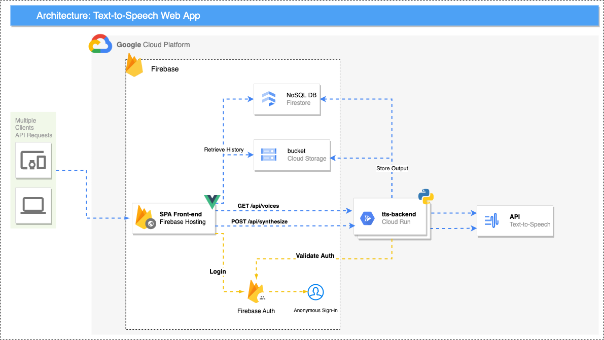

# Google Cloud Text-To-Speach Utility
This repository contains the source code for a GCP Text-To-Speach (TTS) Web App hosted on GCP + Firebase.

## Services
- Firebase Hosting (Global CDN + Cloud Storage)
- Firestore
- Firebase Auth
- Cloud Storage
- Cloud Run
- Text-To-Speech

## Required permissions to deploy
- `roles/editor`
  
## Dependencies
- terraform
- gcloud cli
- gsutil cli
- firebase cli
- nodejs & npm
- curl
  
## Architecture 
  
  
    
## How to deploy
```bash
# Clone repo 

cd gcp-text-to-speech-demo

# Log in to gcloud cli 
gcloud auth login

# Configure your CLI to point to the GCP project you want to deploy into
gcloud config set project ${YOUR_GCP_PROJECT_ID}

# Prepare the GCP project
make tf-backend

# Deploy the web App
make app

# Optional cleanup of any remaining artifacts
make clean

```